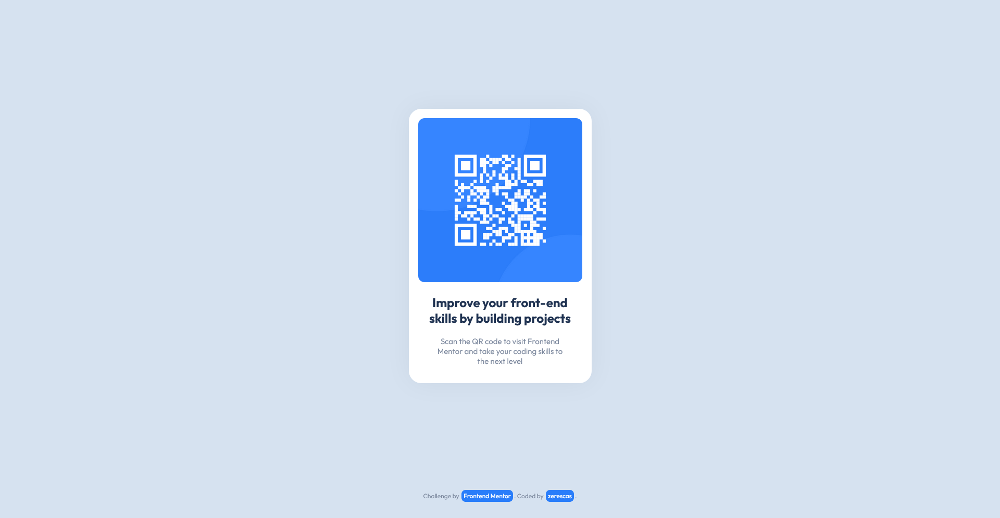

# Frontend Mentor - QR code component solution

This is a solution to the [QR code component challenge on Frontend Mentor](https://www.frontendmentor.io/challenges/qr-code-component-iux_sIO_H). Frontend Mentor challenges help you improve your coding skills by building realistic projects. 

## Table of contents

- [Overview](#overview)
`  - [Screenshot](#screenshot)
  - [Links](#links)
- [My process](#my-process)
  - [Built with](#built-with)
  - [What I learned](#what-i-learned)
  - [Continued development](#continued-development)
  - [Userful resources](#uselful-resources)
- [Author](#author)

## Overview

### Screenshot



### Links

- Live Site URL [https://zerescas.github.io/qr-code-component/](https://zerescas.github.io/qr-code-component/)

## My process

### Built with

- Basic HTML5 with Semantic markup
- CSS Flexbox

### What I learned

This is one of the first pages made myself looking only on a design. Troubles were appearing already on beginning. Which CSS properties should I use to complete the challenge with a preferably normal solution. Maybe I should use a display tag?

```css
.elem {
  display: absolute;
  right: 50%;
  bottom: 50%;
  transform: translate(50%, 50%);
}
```

It center an element but break HTML flow. It works with only one element on a webpage but what if it will be more elements on a webpage. After some time I realized that I should better to learn about flexboxes and use it. So I end up with a such structure:

```html
<div class="page">

  <section class="content">

    <div class="qr-code-container"></div>

  </section>

  <footer class="footer"></footer>

</div>
```

### Continued development

- Make more structured, readable a HTML5 and CSS code with better naming of classes and id
- Understand how to better split HTML5 elements

### Useful resources

- [Comphensive guide about CSS Flexboxes](https://css-tricks.com/snippets/css/a-guide-to-flexbox/) - 

## Author

- Twitter [https://twitter.com/zerescas](https://twitter.com/zerescas)