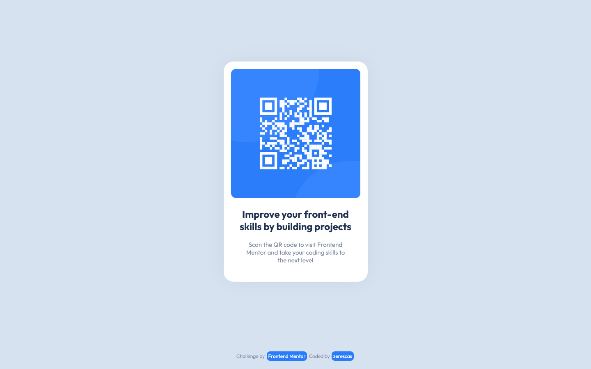

# Frontend Mentor - QR code component solution

This is a solution to the [QR code component challenge on Frontend Mentor](https://www.frontendmentor.io/challenges/qr-code-component-iux_sIO_H). Frontend Mentor challenges help you improve your coding skills by building realistic projects. 

## Table of contents

- [Overview](#overview)
  - [Screenshot](#screenshot)
  - [Links](#links)
- [My process](#my-process)
  - [Built with](#built-with)
  - [What I learned](#what-i-learned)
  - [Continued development](#continued-development)
- [Author](#author)

## Overview

### Screenshot

### Links

- Live Site URL [https://zerescas.github.io/qr-code-component/](https://zerescas.github.io/qr-code-component/)

## My process

### Built with

- Basic HTML5 with Semantic markup
- Basic CSS

### What I learned

<strong>In Progress...</strong>

### Continued development

- Make more structured, readable a HTML5 and CSS code with better naming of classes and id

## Author

- Twitter [https://twitter.com/zerescas](https://twitter.com/zerescas)